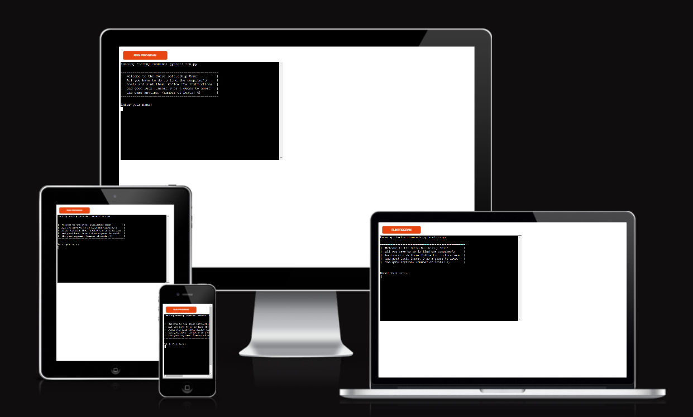
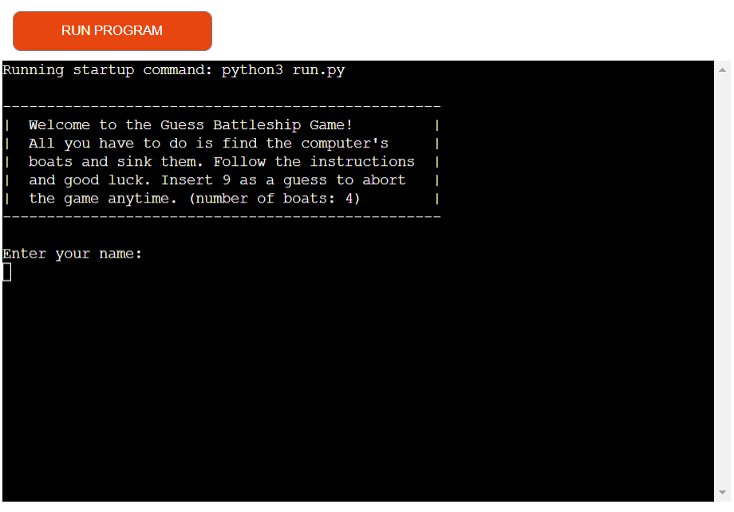
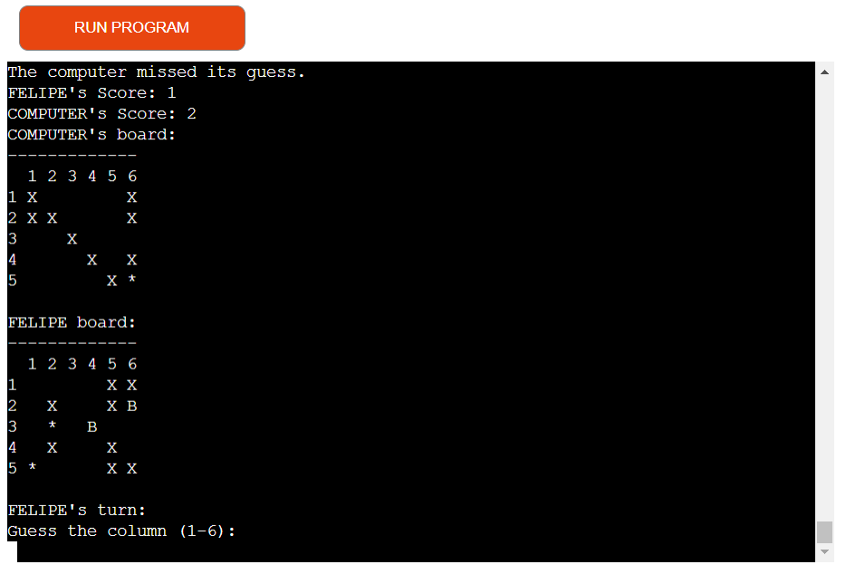
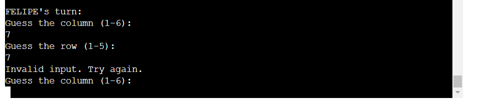
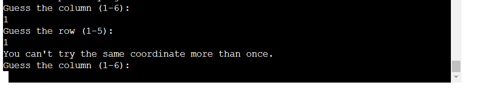
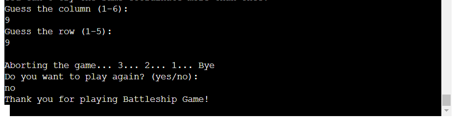
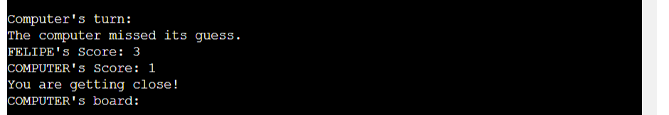
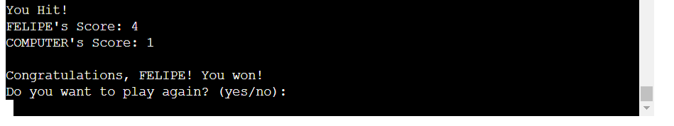
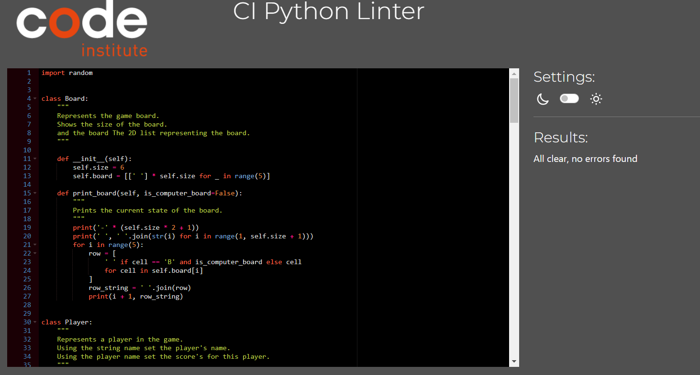

# Guess Battleship Game

## Overview
The Battleship Game is a classic board game where players try to sink each other's battleships by guessing the
coordinates on the opponent's board. In this game all you have to do is find computer's boats and sink them. 
Each boat has just one space in the board. After find 4 boats you win 

  

 

You can try here the [Live version](https://guess-battleship-game.herokuapp.com/)

 

# User Goals
 1. Enjoy a classic and engaging board game experience.
 2. Compete against the computer and try to outsmart it.
 3. Track their score and aim to achieve a high score.
 4. Have the flexibility to abort the game at any time.

## User Stories
1. As a user, I want to view the current state of the board and my opponent's board.
2. As a user, I want to make valid guesses and receive feedback on hits and misses.
3. As a user, I want to track my score and my opponent's score during gameplay.
4. As a user, I want to have the option to play again after the game ends.
## Scope
* The game should provide an interactive interface for players to enter their guesses.
* The game should validate user input and provide appropriate feedback.
* The game should track the scores of both the player and the computer.
* The game should have a clear termination condition and offer the option to play again.

# How to Play
The game starts with the placement of battleships on both the player's and the computer's board.
But before the player will find a welcome board with first instructions and how to play the game. 
Just underneath the board player will find a clear space to insert his name. They can type any kind of name like words,
numbers or nickname. 

Players take turns guessing the coordinates of the opponent's battleships.
If a guess hits an opponent's battleship, it is marked as a hit ('*'), and the player scores a point.
If a guess misses, it is marked as a miss ('X').

The game continues until one player sinks all of the opponent's battleships.
During the game player has to find out where is the computer's boats into 30's space board proivde. 
Players will see 6 collums and 5 rows to guess. A number that its not between the range from collum 1-6 and row 1-5 it will return an invalid guess. 

The game will not allow the player to try the same guess. So if it happen a message will alert they that it was tried already to choose another guess. 

Players can abort the game by entering '9' as a guess.

The game provide also the score board with score of each player in real time after each guess. 

Win the game who first guess all 4 boats. The game will display a message congratulating and asking if player wants to play again. If he types "yes" the it will execute start game and the loop. If he types anything other than "yes" the code will execute end game function. 

 

# Features
## Existing Features
* Random placement of battleships on the board.
* Interactive gameplay where players alternate turns.
* Real-time feedback on hits, misses, and scores.
* Option to abort the game at any time.
* Play again feature after the game ends.

## Features to Implement
* Improved computer player logic for more strategic guesses.
* Graphical user interface (GUI) for a more engaging gaming experience.
* Difficulty levels to adjust the computer player's skill level.
* Multiplayer mode to play against another human player.

# Data Model

The game consists of the following classes:

* Board: Represents the game board and provides methods to print the board and place battleships.
* Player: Represents a player and stores their name, guesses, and score.
* BattleshipGame: The main game class that controls the gameplay and manages the player and computer boards.

# Testing
The Battleship Game has been tested extensively to ensure its functionality and accuracy. 
The code was passed through [PEP8 Python Validator](https://pep8ci.herokuapp.com/#) and no issues were found. The line lengths have been adjusted to adhere to the recommended maximum of 79 characters per line.

The following test cases were considered:

* Placing battleships randomly and ensuring they do not overlap.
* Validating user input for guesses and handling invalid inputs.
* Checking hits and misses during gameplay.
* Verifying game termination conditions.
* Abortion game option to execute end game or also start game again. 

## Solved Bugs
* Computers boats were displaying the board 
* Computers guesses were not getting ("*") sign when hit a right guess. 
* Game was not restarting as per request in the end of the game.

## Unsolved Bug
If the player plays too fast, the turn of the computer player may be missed, leading to consecutive turns for the player.

# Deployment
Steps to deployment were followed from Code Institute learning material.
 

* Sign in to your Heroku account.
* Access the main page and click the "New" button in the top-right corner. Choose "Create New App" from the drop-down menu.
* Choose a unique name for your app and select the region.
* Once the app is created, go to the Deploy Tab and select the "Settings" Tab. Scroll down to "Config Vars".
* Click "Reveal Config Vars" and enter "port" as the key, and "8000" as the value. Click "Add" to confirm the entry.
* Next, enter your Google credentials into the "CREDS" key and value fields.
* Go back to the Buildpack section and select "python", then click "Save Changes". Repeat this step to add "node.js", ensuring that the Buildpacks are in the correct order.
* Go to the "Deploy" tab and select "Github" as the deployment method. Confirm that you want to connect to GitHub and search for the repository name.
* Scroll to the bottom of the page and choose your preferred deployment type.
* Finally, click "Manual Dedploy" or "Enable automatic update".

# Credits
This Battleship Game was created as an example by Felipe Zanetti for my 3rd milestone project. 
The game concept is based on the classic board game Battleship.
The [w3schools](https://www.w3schools.com/python/) where used for clarifications and updates. 
The deployment steps provided in this README were adapted from the Code Institute learning material.
Deployment

